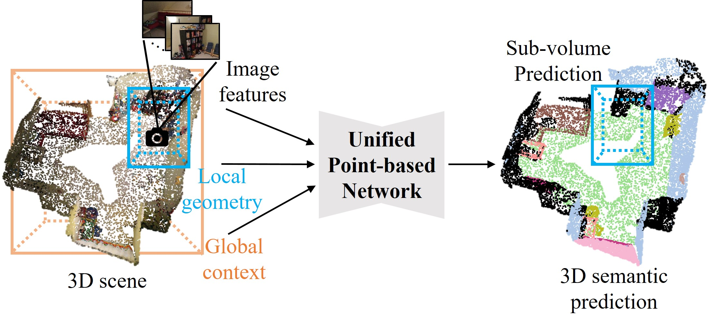

# A Unified Point-Based Framework for 3D Segmentation

This repository contains the implementation of *A Unified Point-Based Framework for 3D indoor scene semantic segmentation*. 


## Prepare Data and 3D Evaluation
The preprocessing steps of ScanNet v2 dataset. Some of the codes are borrowed from [3DMV](https://github.com/angeladai/3DMV). We render the images from 3D indoor scenes in ScanNetV2 dataset, and use the images to train deeplab.  

## DeepLab
The implementation is orignal from [DeepLab](https://github.com/tensorflow/models/tree/master/research/deeplab). We use DeepLab as our image feature extractor, and back-project the feature onto 3D vertices. To train or to finetune our model, please see the README.md inside the directory.

## Joint Model
The model predicts points' semantics with a local encoder, a global encoder and a decoder. The input features (color feature, geometry feature) are fused into point-based representation. To train or to finetune our model, please see the README.md inside the directory.


## 3D Evaluation
For evaluation, we use the code provided from [ScanNet Banchmark](https://github.com/ScanNet/ScanNet) to evaluate our model performance.


## Citation
If you find this repository useful, please cite:
```
@article{chiang2019unified,
  title={A Unified Point-Based Framework for 3D Segmentation},
  author={Chiang, Hungyueh and Lin, Yenliang and Liu, Yuehcheng and Hsu, Winston H},
  journal={arXiv preprint arXiv:1908.00478},
  year={2019}
}
```
